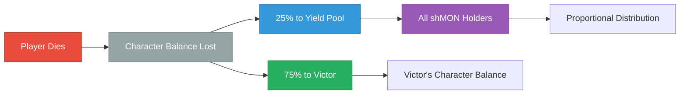

# Battle Nads Economy Guide

## Understanding shMON

Battle Nads uses **shMON** (staked MON) to demonstrate a functional blockchain game economy.

### Token System Basics

- **shMON** = Staked MON locked in the game
- **Character Balance**: Earned by defeating enemies, lost on death
- **Bonded Balance**: Minimum 0.05 shMON required for auto-defense
- **Yield Distribution**: 25% of defeated player balances boost yield for all holders

### Auto-Defense Mechanism

Your bonded shMON enables automatic defense when attacked:
- Other players can attack you even when offline
- Your character automatically defends using bonded shMON
- Without sufficient bonded shMON, you cannot defend yourself
- Keep bonded shMON funded to protect your earned character balance

### Cost Structure

**Starting Costs**
- Character creation: 0.1 shMON buy-in
- Minimum bonded: 0.05 shMON for operations
- Total needed: ~0.15 MON to start playing

**Operational Costs**
- Each action costs ~0.003-0.005 MON from bonded balance
- Daily active play: ~0.1-0.3 MON depending on activity

### Economic Flow

This creates:
- Risk/reward gameplay mechanics
- Passive income for all participants
- Natural wealth redistribution

### Basic Strategies

**Conservative**: Fight weaker enemies, maintain small balance, earn steady yield

**Aggressive**: Target players and strong enemies, risk large balance for big rewards

**Balanced**: Mix safe farming with calculated risks, cash out gains periodically

### Technical Demonstration

The economy showcases:
- Fully on-chain token economics
- Automated yield distribution
- Gas abstraction for seamless transactions
- Economic game theory in practice

Battle Nads proves that complex token economies can operate entirely on blockchain without centralized management.