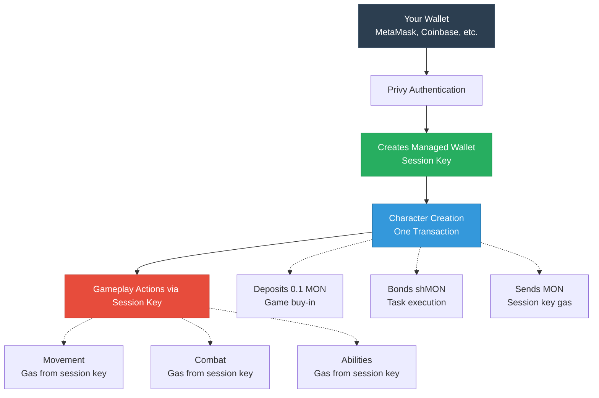
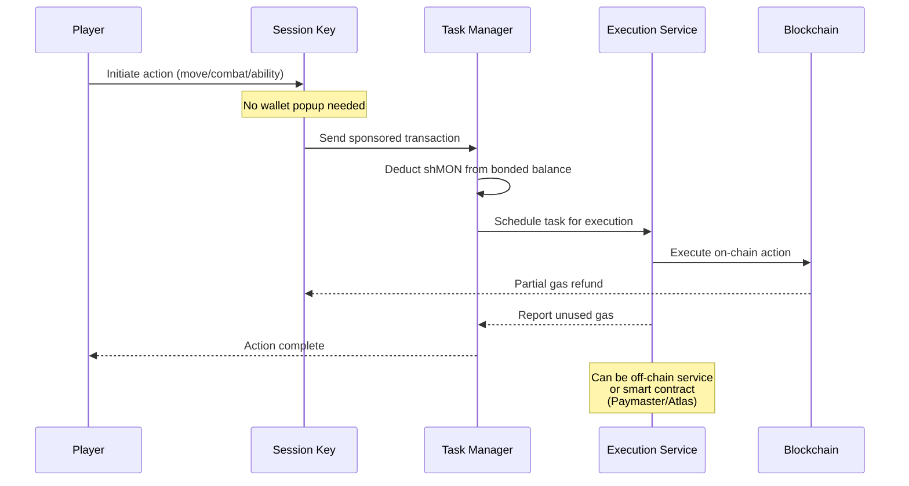
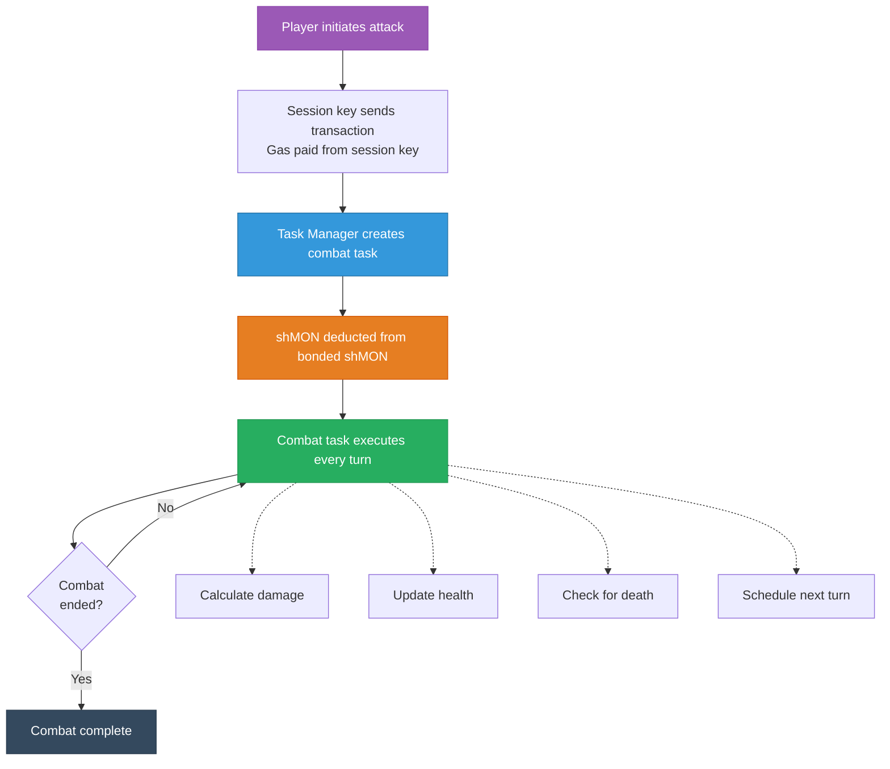
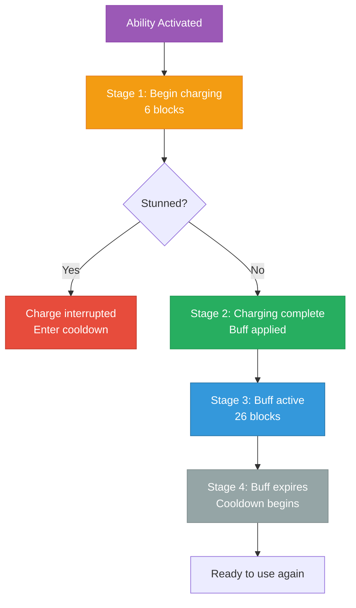

# Battle Nads - Complete Player Guide

## Table of Contents

- [Getting Started](#getting-started)
- [Core Game Systems](#core-game-systems)
- [Economic System](#economic-system)
- [Character Creation & Progression](#character-creation--progression)
- [Combat System](#combat-system)
- [Movement & Exploration](#movement--exploration)
- [Equipment System](#equipment-system)
- [Death & Revival](#death--revival)
- [Session Keys & Gas Management](#session-keys--gas-management)
- [Task System](#task-system)
- [Social Features](#social-features)
- [Advanced Strategies](#advanced-strategies)
- [Unique Game Approach](#unique-game-approach)
- [Technical Context](#technical-context)
- [Troubleshooting](#troubleshooting)

## Getting Started

### What is Battle Nads?

Battle Nads is a blockchain-based tactical RPG where players create characters, explore dungeons, engage in combat, and compete for economic rewards. The game runs autonomously on-chain using an innovative task system that automates character actions.

### Creating Your First Character

For detailed step-by-step character creation instructions, see the [Quick Start Guide](quick-start-guide.md#step-3-create-your-character-one-click).

**Key Requirements:**
- ~0.15 MON tokens (0.1 for buy-in + 0.05 minimum bonded)
- Character spawns after 8 blocks (~4 seconds)
- Class is randomly assigned
- Session key automatically created with Privy wallet

## Core Game Systems

### Character Attributes

- **Strength**: Primary damage scaling, affects weapon damage
- **Vitality**: Health pool and regeneration rate
- **Dexterity**: Hit chance and minor damage bonus
- **Quickness**: Turn speed and hit chance
- **Sturdiness**: Health pool and damage resistance
- **Luck**: Critical hits, turn speed, and hit chance

### Character Classes

Each class provides unique stat bonuses and abilities:

#### Warrior

- **Bonuses**: +3 Strength, +2 Vitality, -1 Quickness
- **Abilities**:
  - Shield Bash (Offensive): Stuns + deals damage, auto-initiates combat
  - Shield Wall (Defensive): Reduces incoming damage to 1/4
- **Playstyle**: Tank/DPS hybrid, excellent survivability
- **Health Bonus**: +30 per level + 50 base

#### Rogue

- **Bonuses**: +3 Dexterity, +2 Quickness, +1 Luck, -1 Strength
- **Abilities**:
  - Apply Poison (Offensive): DoT over 13 stages, auto-initiates combat
  - Evasive Maneuvers (Defensive): Increases dodge chance
- **Playstyle**: High damage, poison specialist
- **Health Penalty**: -20 per level - 100 base

#### Monk (Cleric)

- **Bonuses**: +2 Sturdiness, +2 Luck, -1 Dexterity
- **Abilities**:
  - Smite (Offensive): Curses + deals damage, auto-initiates combat
  - Pray (Support): Heals self or allies, reduces your damage output
- **Playstyle**: Support and healing specialist
- **Health Bonus**: +20 per level

#### Sorcerer (Mage)

- **Bonuses**: -1 Strength, -1 Vitality, -1 Sturdiness
- **Abilities**:
  - Fireball (Offensive): High damage attack, auto-initiates combat
  - Charge Up (Defensive): +50% damage on next attacks
- **Playstyle**: Magical damage specialist
- **Health Penalty**: -30 per level - 50 base

#### Bard

- **Bonuses**: -1 to all stats
- **Abilities**:
  - Do Dance: Currently no gameplay effect
  - Sing Song: Currently no gameplay effect
- **Playstyle**: Challenge mode with stat penalties
- **Health Penalty**: -40 per level - 100 base

## Economic System

### shMON Token System

Battle Nads uses a sophisticated economic model based on shMON (staked MON) tokens:

Battle Nads uses a sophisticated economic model based on shMON (staked MON) tokens. For comprehensive economic mechanics and strategies, see the [Game Economy Guide](game-economy-guide.md).

**Key Points:**
- **Buy-in**: 0.1 shMON to create character
- **Bonded Balance**: Min 0.05 shMON for auto-defense
- **Yield Boost**: 25% of defeats boost holder yields
- **Task Costs**: ~0.003-0.005 MON per action
- **Death Impact**: Balance redistributed to victor

### Economic Strategies

For detailed economic analysis and strategies, see the [Game Economy Guide](game-economy-guide.md).

**Key Points:**
- Balance aggressive play with survival
- Maintain sufficient bonded MON
- Choose fights based on risk/reward
- Strategic retreating can be profitable

## Character Creation & Progression

### Stat Allocation Strategy

You have 14 points to distribute across 6 attributes. Since your class is randomly assigned, here are recommended builds for each class:

#### Warrior (Tank/DPS)

- Strength: 4, Vitality: 3, Dexterity: 2, Quickness: 2, Sturdiness: 2, Luck: 1
- Focus on Strength and Vitality to maximize health and damage

#### Rogue (High Damage)

- Strength: 2, Vitality: 1, Dexterity: 4, Quickness: 3, Sturdiness: 1, Luck: 3
- Prioritize Dexterity and Quickness for hit chance and turn frequency

#### Monk (Support)

- Strength: 2, Vitality: 2, Dexterity: 2, Quickness: 2, Sturdiness: 3, Luck: 3
- Balanced build with emphasis on Sturdiness and Luck

#### Sorcerer (Magic DPS)

- Strength: 1, Vitality: 2, Dexterity: 3, Quickness: 3, Sturdiness: 2, Luck: 3
- Focus on magical stats while maintaining survivability

#### Bard (Challenge Mode)

- Strength: 2, Vitality: 3, Dexterity: 2, Quickness: 2, Sturdiness: 3, Luck: 2
- Balanced approach to offset stat penalties

### Level & Equipment Progression

For detailed progression strategies:
- **Leveling Guide**: See [Combat Analysis & Leveling Guide](combat-analysis-and-leveling-guide.md#leveling-progression)
- **Equipment Guide**: See [Equipment Progression Guide](equipment-progression-guide.md)

**Quick Reference:**
- XP from enemy defeats (3x for PvP)
- Max level: 50
- +1 stat point per level
- Better loot from higher level enemies
- Limited inventory requires strategy

## Combat System

### Combat Overview

Combat in Battle Nads is turn-based and fully automated after initiation.

#### Key Combat Concepts

- **Turn Order**: Based on Quickness and Luck stats
- **Hit Chance**: Influenced by Dexterity, weapon accuracy, and status effects
- **Damage**: Determined by Strength, weapon damage, and armor
- **Health**: Scales with level, Vitality, and Sturdiness
- **Regeneration**: Vitality increases health recovery per turn

For detailed combat mechanics and formulas, see the [Combat Analysis Guide](combat-analysis-and-leveling-guide.md).

### Combat States & Effects

#### Status Effects & Combat Modifiers

For detailed mechanics, see the [Combat Analysis Guide](combat-analysis-and-leveling-guide.md#status-effects).

**How Abilities Affect Combat:**

**Defensive Modifiers:**
- **Blocking** (Shield Wall): Damage reduced to 1/4 (Warrior) or 1/3 (others)
- **Evading** (Evasive Maneuvers): Increased dodge chance
- **Stunned** (Shield Bash target): Easier to hit

**Offensive Modifiers:**
- **Charged Up** (Charge Up): +50% damage + 10 flat damage
- **Praying** (Pray): -33% damage output while healing
- **Poisoned** (Apply Poison): 4 + (level/10) damage per turn
- **Cursed** (Smite): Prevents health regeneration

**Combat Flow:**
1. Use ability → Status effect applied
2. Regular attacks → Modified by active effects
3. Effects persist until duration expires

#### Ability Cooldowns

**Warrior:**
- Shield Bash: 24 blocks (12 seconds)
- Shield Wall: 24 blocks (12 seconds)

**Rogue:**
- Evasive Maneuvers: 18 blocks (9 seconds)
- Apply Poison: 64 blocks (32 seconds) - longest cooldown

**Monk:**
- Pray: 72 blocks (36 seconds) - plan usage carefully
- Smite: 24 blocks (12 seconds)

**Sorcerer:**
- Charge Up: 36 blocks (18 seconds) - can be interrupted
- Fireball: 56 blocks (28 seconds)

**Bard:**
- Sing Song: 0 blocks (no cooldown)
- Do Dance: 0 blocks (no cooldown)

**Tip:** Abilities with longer cooldowns are generally more powerful!

#### Boss Encounters

- **Boss Spawning**: Bosses appear at staircase coordinates
- **Aggro Range**: Bosses check all 64 slots in their area (guaranteed aggro)
- **Rewards**: Superior loot and experience rewards
- **Strategy**: Clear the area before approaching staircase locations

### Combat Strategies

For advanced combat strategies and detailed mechanics, see the [Combat Analysis Guide](combat-analysis-and-leveling-guide.md).

**Essential Tips:**
- Each area has 64 slots for all entities
- Combat triggers when monsters are within aggro range slots
- Select targets based on level and equipment
- Time abilities for maximum effect
- Know when to retreat

## Movement & Exploration

### Dungeon Structure

Battle Nads features a 3D dungeon system:

#### Coordinate System

- **X-Axis**: 1-50 (West to East)
- **Y-Axis**: 1-50 (South to North)
- **Depth**: 1-50 (Surface to Deep Underground)

#### Movement Rules

- **Adjacent Movement**: Can only move to adjacent tiles (no diagonal movement)
- **Single Axis**: Can only change one coordinate per move (X, Y, or Depth)
- **Combat Restriction**: Cannot move while in combat
- **Area Capacity**: Maximum 64 slots per area (players + monsters)

#### Depth Progression (Moving Up/Down)

- **Depth Changes**: You can only move up or down at specific "staircase" coordinates
- **Location Requirement**: Must be at exact staircase coordinates to change depth
- **Staircase Locations**: Each depth has a unique staircase location
- **Progressive Difficulty**: Deeper levels = stronger monsters and better rewards

**How to Change Depths:**

1. Navigate to your current depth's staircase coordinates
2. Use `moveUp()` to go deeper or `moveDown()` to go shallower
3. You can only change by 1 depth level at a time

**First 4 Staircase Locations:**

- Depth 1→2: (25, 25) - Always at center
- Depth 2→3: (35, 15) - Southeast quadrant
- Depth 3→4: (15, 35) - Northwest quadrant
- Depth 4→5: (14, 14) - Southwest quadrant

**Hint:** Further depths follow a pattern - explore to discover it!

### Exploration Mechanics

#### Spawn System

- **Initial Spawn**: Characters spawn at depth 1 in random valid locations
- **Spawn Criteria**: Locations with fewer than 16 total occupants preferred
- **Spawn Delay**: 8 blocks after character creation

#### Aggro System (Slot-Based Mechanics)

**How Areas Work:**
- Each map location (x,y) contains 64 slots (0-63)
- Players and monsters occupy different slots within the same area
- Multiple entities can exist at the same coordinates

**Aggro Range = Number of Slots Checked:**
- **Normal Monsters**: 12 + current depth (max 22 slots)
- **Boss Monsters**: Check all 64 slots in the area
- **Level Scaling**: Higher level players may have reduced aggro

**When You Enter an Area:**
1. You occupy a random slot (e.g., slot 25)
2. System checks next N slots based on aggro range
3. If monster found → Combat starts
4. If empty slot found → 18/128 chance to spawn new monster

**Example:** At position (20,23) with aggro range 13:
- You're at slot 25
- Checks slots 26-38 in circular order
- Monster at slot 30 = AGGRO!
- Empty slot 35 = Possible spawn location

### Navigation Strategies

1. **Safe Exploration**: Each area has 64 slots - you might avoid monsters even in occupied areas
2. **Level Appropriate Zones**: Stay in areas matching your character level
3. **Finding Staircases**: Memorize the first few locations, then discover the pattern
4. **Boss Preparation**: Bosses at staircases check all 64 slots (guaranteed aggro)
5. **Escape Routes**: Always plan retreat paths before engaging in combat
6. **Slot Awareness**: Remember multiple players/monsters can occupy the same coordinates

### Depth Navigation Guide

**To Move Between Depths:**

1. Navigate to your current depth's staircase coordinates
2. Use `moveUp()` to go deeper (higher depth number) or `moveDown()` to go shallower
3. You'll arrive at the same coordinates on the new depth level

**Navigation Tips:**

- Start by memorizing the first 4 staircase locations
- Observe the pattern as you explore deeper levels
- Boss monsters often guard staircase locations
- Hint: The pattern involves corners and increasing distances

## Equipment System

### Equipment Types

#### Weapons (64 different types)

- **Damage Range**: Varies by weapon type and level requirement
- **Accuracy Bonus**: Affects hit chance in combat
- **Level Requirements**: Higher level weapons require character level
- **Special Properties**: Some weapons have unique combat effects

#### Armor (64 different types)  

- **Defense Rating**: Reduces incoming damage
- **Level Requirements**: Higher level armor requires character level
- **Class Restrictions**: Some armor types may have class preferences
- **Durability**: Equipment may degrade over time (implementation dependent)

### Loot System

- **Drop Chances**: Based on defeated enemy level and type
- **Quality Scaling**: Higher level enemies drop better equipment
- **Inventory Management**: Limited inventory space requires strategic decisions
- **Equipment Management**: Use the equipment panel to change weapons and armor

### Equipment Strategy

For comprehensive equipment strategies and progression paths, see the [Equipment Progression Guide](equipment-progression-guide.md).

**Quick Tips:**
- Balance weapon and armor upgrades
- Match equipment to your character level
- Choose gear that complements your class
- Optimize limited inventory space

## Death & Revival

### Death Mechanics

When your character dies:

#### Immediate Effects

- **Health**: Drops to 0, character becomes inactive
- **Location**: Removed from current area
- **Combat**: All combat engagements end immediately
- **Tasks**: All scheduled tasks are cancelled

#### Economic Impact

- **Balance Loss**: Your entire shMON balance is redistributed
- **Victor Reward**: Killer receives majority of your balance
- **Yield Boost**: 25% of balance boosts yield for all shMON holders
- **Monster Pool**: Remaining balance may go to monster distribution pool

### Death Prevention

1. **Health Monitoring**: Keep track of your health status
2. **Strategic Retreat**: Use ascend command to cash out before death
3. **Combat Avoidance**: Don't engage fights you can't win
4. **Balance Management**: Don't risk more than you can afford to lose

### Recovery Options

- **Character Recreation**: Create a new character after death
- **Fresh Start**: New character begins with basic equipment and stats
- **Economic Reset**: Must invest new buy-in amount for new character

## Session Keys & Gas Management

### Session Key System

Session keys enable gasless gameplay through Privy's managed wallet system:

#### How the System Works

#### Transaction Flow for Actions

#### Key Benefits

- **Gasless Transactions**: Play without paying gas for each action
- **Automated Gameplay**: Characters can act autonomously
- **Cost Efficiency**: Bulk gas payment reduces per-transaction costs
- **User Experience**: Seamless gameplay without constant wallet interactions

#### Important Notes

- **Low session key balance** may cause combat tasks to fail
- **The UI will indicate** if tasks are broken due to insufficient balance
- **Refund your session key** when balance runs low to continue playing

#### Session Key Setup

1. **Key Creation**: Generate a new wallet address for your session key
2. **Authorization**: Authorize the session key with expiration time
3. **Funding**: Deposit MON to cover expected gas costs
4. **Activation**: Session key becomes active for specified duration

#### Session Key Management

- **Expiration**: Keys expire after set time period
- **Balance Monitoring**: Keep sufficient balance for gas costs
- **Security**: Session keys have limited permissions
- **Renewal**: Extend or refresh keys as needed

### Gas Economics

Understanding gas costs helps optimize your gameplay:

#### Transaction Types & Costs

- **Character Creation**: ~850,000 gas + movement buffer
- **Movement**: ~400,000 gas additional buffer
- **Combat Actions**: ~299,000 gas per automated turn
- **Ability Usage**: Variable based on ability complexity
- **Administrative**: Lower gas for status checks, queries

#### Cost Optimization

1. **Session Key Usage**: Significantly reduces per-transaction costs
2. **Bulk Operations**: Combine multiple actions when possible
3. **Strategic Timing**: Time actions to minimize gas waste
4. **Balance Planning**: Maintain sufficient balance for extended play

## Task System

### Automated Gameplay

Battle Nads uses a sophisticated task system for autonomous character operation:

#### How Combat Automation Works

- **Combat is fully automated** - you only need to initiate the first attack
- **The Task Manager handles all turns** - no need to spam transactions
- **Abilities execute automatically** when used - multi-stage abilities continue without intervention
- **Only manual action needed**: Starting combat or movement between areas

#### Task Types

- **Combat Tasks**: Automated combat turn execution
- **Spawn Tasks**: Character spawning after creation
- **Ability Tasks**: Multi-stage ability execution
- **Movement Tasks**: Location change processing

#### Task Economics

- **Task Costs**: Each task execution costs MON from your bonded shMON
- **Scheduling**: Tasks are scheduled for future block execution
- **Priority**: Task execution follows priority and gas availability
- **Failure Handling**: Failed tasks may be rescheduled or cancelled

### Combat & Ability System

#### Understanding Abilities

**Offensive Abilities (Auto-Initiate Combat):**
- **Shield Bash** (Warrior): Windup → Stun + Damage
- **Apply Poison** (Rogue): Windup → DoT over 11+ stages
- **Smite** (Monk): Windup → Curse + Damage
- **Fireball** (Sorcerer): Windup → High Damage

**Non-Offensive Abilities (Buffs/Support):**
- **Shield Wall** (Warrior): Defense buff only
- **Evasive Maneuvers** (Rogue): Evasion buff only
- **Pray** (Monk): Healing only (can target allies)
- **Charge Up** (Sorcerer): Damage buff for next attacks

**No Effect (Bard):**
- **Sing Song**: Currently no gameplay effect
- **Do Dance**: Currently no gameplay effect

**Important:** 
- Offensive abilities automatically force both you and your target into combat when used!
- You must specify a target index for offensive abilities
- Non-offensive abilities can be used anytime without a target

#### Why You Might Not See Immediate Damage

1. **Windup Stages**: Most offensive abilities have a windup phase
   - Stage 1 is preparation (no damage)
   - Damage occurs in later stages
   - Each stage takes several blocks

2. **Task Delays**: Abilities execute via scheduled tasks
   - Not instant - requires block confirmations
   - Multi-stage abilities take multiple task executions

3. **Non-Offensive = No Damage**: Buff abilities never deal damage

### Combat Task Automation

Battle Nads showcases advanced Task Manager capabilities:

#### Combat Automation Example

#### Multi-Stage Ability Example (Sorcerer's ChargeUp)

Each stage is a separate task execution, demonstrating:

- **Complex state management** entirely on-chain
- **Timed effects** using block-based scheduling
- **Interruption handling** (stuns can break charge)
- **Gas efficiency** through Task Manager optimization

### Task Management

Players need to understand task implications:

#### Bonded shMON Requirements

- Characters need sufficient bonded shMON for auto-defense
- Without bonded shMON, your character cannot defend when attacked
- Low bonded shMON = defenseless character that others can freely attack
- Recommended: Keep well above 0.05 shMON for continuous protection

#### Task Monitoring

1. **Balance Tracking**: Monitor your bonded shMON regularly
2. **Task Costs**: Understand approximate costs for different actions
3. **Failure Recovery**: Know how to handle task scheduling failures
4. **Emergency Funding**: Have backup MON available for emergency funding

## Social Features

### Player Interaction

Battle Nads includes various social and competitive elements:

#### Combat Interaction

- **PvP Combat**: Direct player vs player combat with higher rewards
- **Area Sharing**: Multiple players can occupy the same area
- **Combat Spectating**: Other players can observe ongoing fights
- **Reputation**: Player performance may affect social standing

#### Communication Systems

- **Chat Logs**: In-game messaging system for player communication
- **Combat Logs**: Detailed logs of combat actions and results
- **Area Events**: Notifications about significant area events
- **Player Status**: Public visibility of player stats and equipment

### Community Features

1. **Guild Systems**: Player organizations for mutual support (if implemented)
2. **Tournaments**: Organized competitive events (if implemented)
3. **Leaderboards**: Rankings by level, wealth, or achievements
4. **Market Systems**: Player-to-player trading and economic interaction

## Advanced Strategies

### Economic Optimization

1. **Balance Cycling**: Maintain optimal balance between risk and reward
2. **Market Timing**: Understand economic cycles and player behavior
3. **Resource Allocation**: Efficiently distribute resources between growth and safety
4. **Yield Maximization**: Leverage yield boost mechanics for passive income

### Combat Mastery

1. **Build Optimization**: Create specialized builds for specific playstyles
2. **Ability Synergy**: Combine class abilities for maximum effectiveness
3. **Positioning Strategy**: Control area occupancy and combat positioning
4. **Meta Analysis**: Understand current competitive landscape and adapt

### Long-term Planning

1. **Character Development**: Plan stat allocation and equipment progression
2. **Economic Sustainability**: Maintain long-term economic viability
3. **Risk Management**: Balance aggressive play with survival needs
4. **Community Engagement**: Build relationships and alliances with other players

## Unique Game Approach

### A Technical Innovation Demo

Battle Nads isn't just a game—it's a groundbreaking demonstration of blockchain technology that makes Web3 gaming accessible and practical:

#### Gasless Gaming Through FastLane

The game showcases **FastLane's Gas Abstraction** technology:

- **Session Keys**: Play without paying for every transaction
- **Automated Execution**: Your character acts autonomously through the Task Manager
- **Seamless Experience**: No wallet popups or gas fee interruptions during gameplay

#### Priority Access with Liquid-Priority RPC

Battle Nads integrates with FastLane's innovative RPC service:

- **ShMON-Based Priority**: More ShMON = faster, more reliable gameplay
- **Congestion Resistance**: Stay connected even when the network is busy
- **Performance Scaling**: Your commitment directly improves your gaming experience

#### Why This Matters

1. **True Blockchain Gaming**: Fully on-chain with no centralized servers
2. **Economic Innovation**: The ShMON economy creates sustainable gameplay incentives
3. **Technical Showcase**: Demonstrates how blockchain can deliver real-time gaming experiences
4. **Community First**: Built by FastLane Labs as a proof of concept for the Monad ecosystem

## Technical Context

### The FastLane Ecosystem

Battle Nads operates within the FastLane Labs ecosystem on Monad:

#### Core Technologies

1. **Task Manager**: Automates on-chain execution
   - Handles combat turns, movements, and abilities
   - Ensures fair, deterministic gameplay
   - Manages complex multi-step interactions

2. **Gas Abstraction Layer**: Enables gasless transactions
   - Session keys for seamless gameplay
   - Bonded ShMON covers execution costs
   - No interruptions for gas payments

3. **Liquid-Priority RPC**: Performance optimization
   - ShMON holders get priority access
   - Reduced latency during network congestion
   - Reliable connection for competitive play

#### Economic Integration

- **ShMON Utility**: Beyond staking—powers gameplay and priority
- **Yield Generation**: Battle outcomes affect ShMON yield rates
- **TVL Growth**: Every player contributes to protocol metrics

### Early Alpha Considerations

As an early alpha product:

- Expect frequent updates and balance changes
- Character and currency resets may occur
- Community feedback drives development
- Not optimized for mobile devices yet

### Known Network Challenges

- **RPC Rate Limits**: May experience connection issues
- **Transaction Delays**: Network congestion affects responsiveness
- **Verification Loops**: Refresh if stuck on "Verifying State"

## Troubleshooting

For comprehensive troubleshooting and solutions to common issues, see the [FAQ & Troubleshooting Guide](faq-troubleshooting.md).

**Quick Help:**
- Character creation issues → [FAQ: Character Creation](faq-troubleshooting.md#1-character-creation-issues)
- Gameplay problems → [FAQ: Gameplay Issues](faq-troubleshooting.md#2-gameplay--mechanics)
- Technical difficulties → [FAQ: Technical Issues](faq-troubleshooting.md#3-wallet--transaction-issues)
- Best practices → [FAQ: Tips for Success](faq-troubleshooting.md#6-tips-for-success)

---

*This guide covers the essential systems every Battle Nads player should understand. The game is complex and constantly evolving, so stay engaged with the community and keep learning as you play.*
